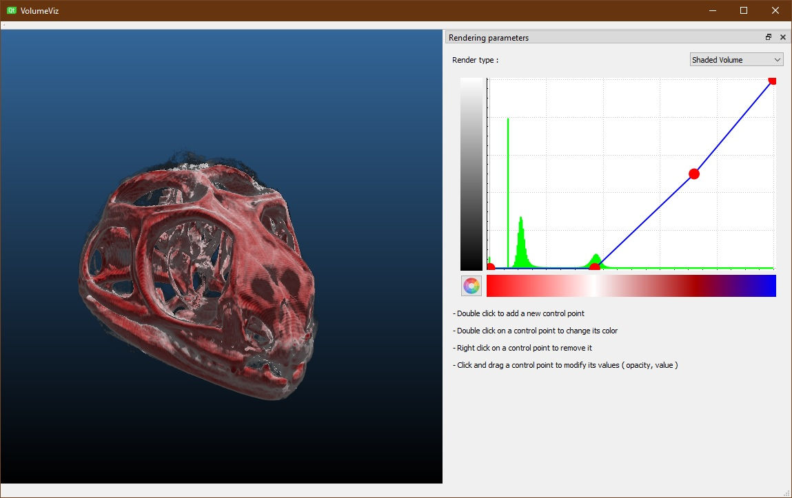

# Volumeviz

* This a sample Volume Rendering project that loads a supplied 3d volume data and gives the user the ability to modify the way it renders its inside, using a transfer function widget.

* The current version supports OpenCL, the next upcoming versions will support more backends such as CUDA.

* The provided source code is modular and was designed so it can be enhanced with more functionnalities.

Happy coding !
